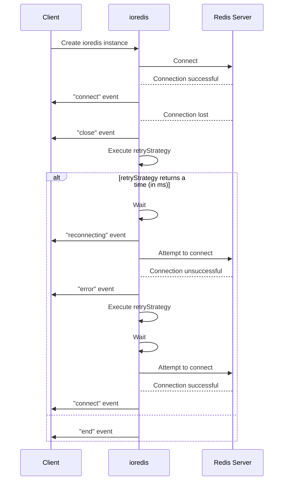
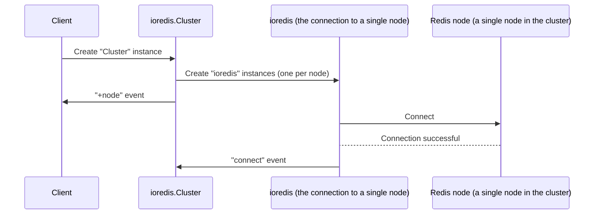
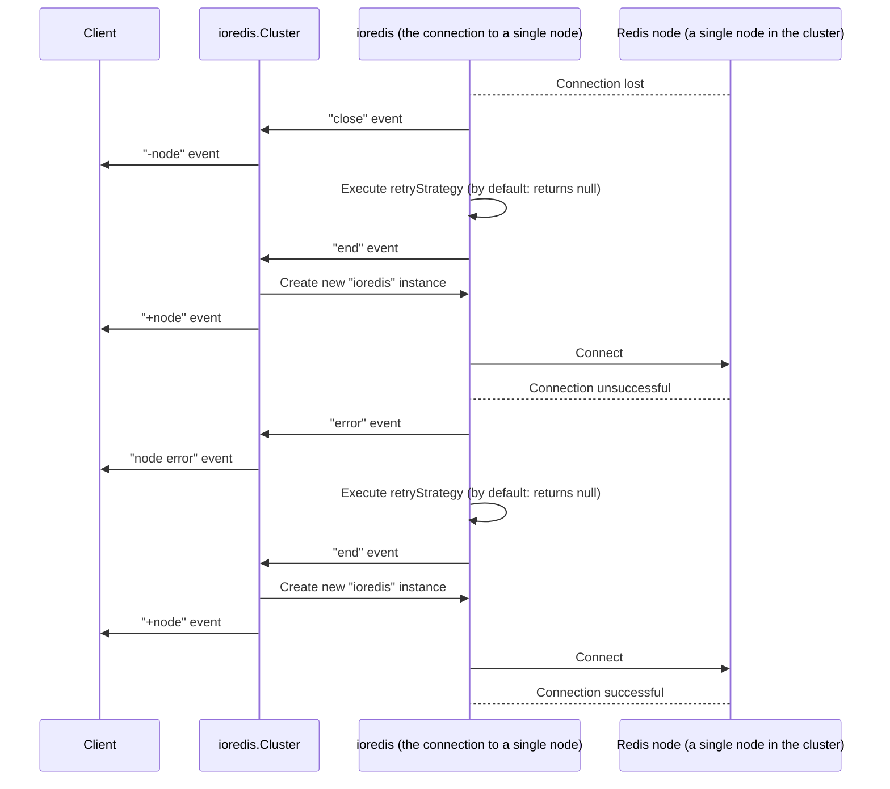
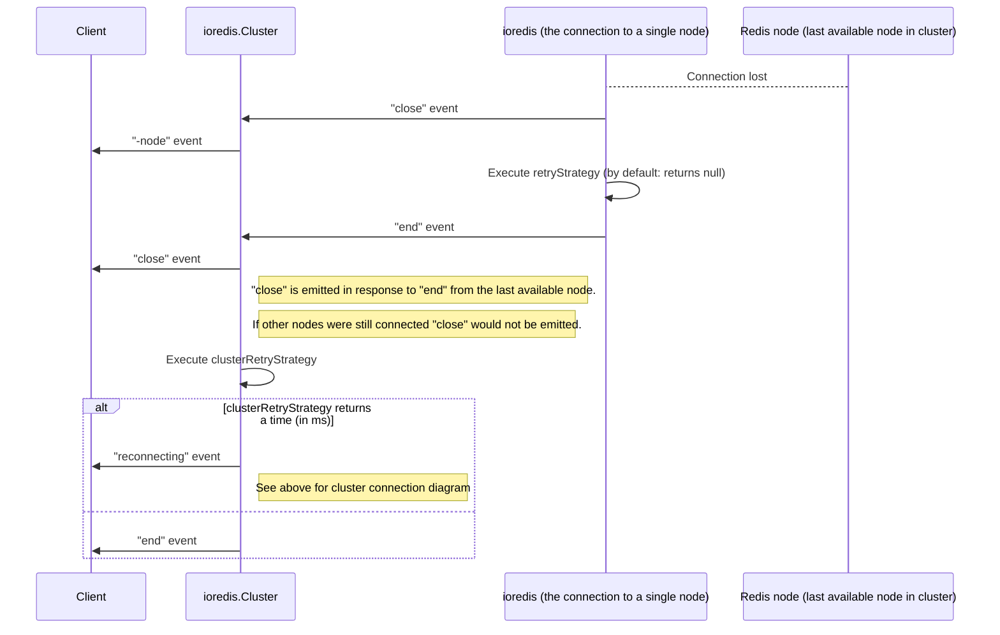

# Redis

## Running a cluster locally

### Start several nodes

```bash
mkdir 7000 7001 7002
```

In each folder, place a Redis configuration file (`redis.conf`) that allows the
node to join a cluster:

```
port 7000
cluster-enabled yes
cluster-config-file nodes.conf
cluster-node-timeout 5000
appendonly yes
```

Start the nodes

```bash
redis-server ./redis.conf
```

### Create the cluster

```bash
redis-cli --cluster create 127.0.0.1:7000 127.0.0.1:7001 127.0.0.1:7002
```

Add `--cluster-replicas n` to configure `n` replicas per shard.

Redis will propose a cluster configuration, which shows the different nodes and
which slots will be allocated to them.

### Connect to the cluster

```bash
redis-cli -c -p 7000
```

## Redis cluster issues

### `TRYAGAIN`

(Probably non-exhaustive) List of scnenarios where this can happen:

- The cluster is currently reconfiguring/resharding
- There has been a failover, but the replica that has been promoted isn't ready
  to accept commands
- The cluster is under heavy load / a script is blocking

### `CLUSTERDOWN`

This error code is returned for any command if at least one of the slots is not
covered by a master node. So it doesn't mean the whole cluster is down, it just
means Redis is refusing to respond until all nodes come back online. This
behaviour can be configured.

When using ioredis, there is an automatic retry mechanism which can be
configured with the `retryDelayOnClusterDown` option (default 100ms)

### `MOVED`

This error basically means "You're asking the wrong node for this".

A classic scenario is when connected to a node with a non-cluster-aware client
and the client asks for a key (or tries to set a key) that doesn't belong in the
node's hash slot. When connected with a cluster-aware client (for example
`redis-cli -c`), the command would succeed an the connection would be redirected
automatically to the right node.

With ioredis, the `Cluster` constructor should be used instead of `Redis`.

### `ASK`

Similar to `MOVED`, but happens when a slot is being migrated to another node,
but that node isn't quite ready.

The scenario goes something like this:

- Slot 3999 is moving from Node A to Node B
- We ask Node A for a key in slot 3999
- Node A replies: `ASK 3999 127.0.0.1:7001`, meaning "this slot is technically
  not mine anymore, but Node B isn’t ready yet. You can ask it once, but don't
  update your slot map yet.”

## ioredis events

### Single instance

For a single Redis instance, this is the flow when a connection is lost:



### Cluster mode

#### Establishing connections



#### A connection to one of the nodes is lost



#### The connection to the last available node is lost

This is what happens when the cluster goes fully down and we lose our connection
to the last available node


